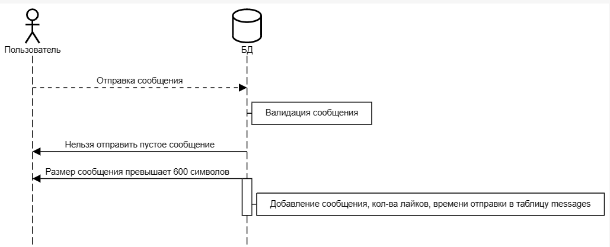
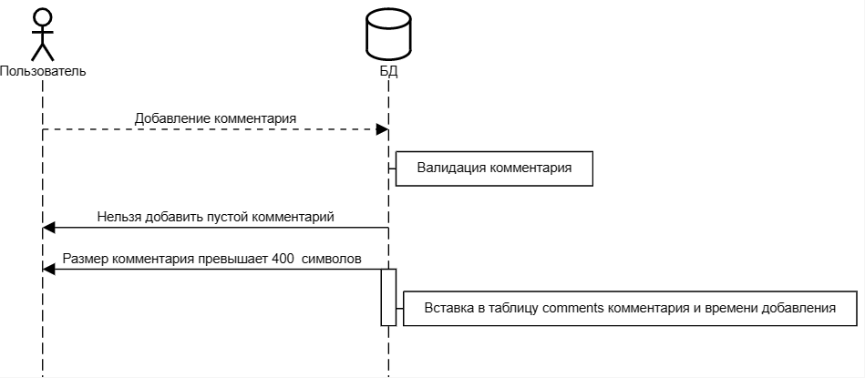

# Реализация шаблона CRUD
***
## Цель работы
Разработать и реализовать клиент-серверную информационную систему, реализующую механизм CRUD
***
## Задание
Система предназначена для анонимного общения в сети интернет.

Интерфейс системы представляет собой веб-страницу с лентой заметок, отсортированных в обратном хронологическом порядке и форму добавления новой заметки. В ленте отображаются последние 100 заметок.

##### Возможности пользователей:
- добавление текстовых заметок в общую ленту
- реагирование на чужие заметки (лайки)
- добавление комментариев к чужим заметкам
- "раскрывающиеся" комментарии
***
## Ход работы
- Разработать пользовательский интерфейс
- Описать сценарии работы
- Описать API сервера и хореографию
- Описать структуру БД и алгоритмы обработки данных
- Написать программный код
- Удостовериться в корректности кода
***
### 1. [Пользовательский интерфейс](https://www.figma.com/file/1LVcNzvROHDAjiWSmrmkGm/GRUD?node-id=0%3A1&t=tKelOUHVIs5jGkQM-0)
***
### 2. Cценарии работы 
**а) Отправка сообщения**


***
**б) Добавление комментария**


***
### 3. API сервера и хореография


***
### 4. Структура базы данных
Таблица ***forum_posts***
| Название | Тип | NULL | Описание |
| :------: | :------: | :------: | :------: |
| **id** | INT  | NO | Автоматический идентификатор поста |
| **mess** | TEXT | NO | Текст заметки |
| **likes** | INT | NO | Количество лайков |
| **dislikes** | INT | NO | Количество лайков |
| **time** | DATETIME | NO | Дата создания поста |

Таблица ***forum_comments***
| Название | Тип | NULL | Описание |
| :------: | :------: | :------: | :------: |
| **id** | INT  | NO | Идентификатор комментария |
| **post_id** | INT  | NO | Идентификатор поста |
| **text** | TEXT | NO | Текст комментария |
| **time** | DATETIME | NO | Дата создания комментария |
***
### 5. [Алгоритмы](https://viewer.diagrams.net/?tags=%7B%7D&highlight=0000ff&edit=_blank&layers=1&nav=1&title=CRUD(1).drawio#R7V3pc6M2FP9rPJ3pTD0IIY6P8dXddo9Oks52P2IjH1scPJhs4v71FYewkITBmMuJvbMEBAij997vnZIHcLx9%2Fd23d%2BvPnoPdgao4rwM4GaiqChSF%2FAlbDnELUPSkZeVvnKTt2PCw%2BQ%2FTC5PW542D95kLA89zg80u27jwnp7wIsi02b7vvWQvW3pu9qk7e4WFhoeF7Yqt3zZOsI5bTdU4tn%2FAm9WaPhnoVnxma9OLkzfZr23He2Ga4HQAx77nBfHe9nWM3XD06LjE981yzqZfzMdPQZkbxv9%2Bdb89P97f%2Fzj88e3PyV75%2B9Pst6SXn7b7nLzwYKIM7sBgAgamGm2VsGUUbyfR1oza9aQ9frngQEfsZb0J8MPOXoTHL4QtBnC0DrYuOQJk197vYjotN6%2BYfLXRcuO6Y8%2F1%2FOh26NjYXC5I%2Bz7wvX8xc0ZfmHi%2BJGdWvu1syFsz5wxs61gh58RRoa%2BI%2FQC%2FMk3JKP2OvS0O%2FAO5JDlrJu9EWZYS8OVI%2F7RtzdKeNtoJz63Sro9kITsJZc6gkipSiR91%2FOTchexOjhauvd9vFtlh973nJycc70k4Svh1E%2FyTnAn3v4ftQ5QcTV6ZyyaH5CB3ZPfes7%2FAxUyGnYyoiePPDDCSjC9t87FrB5ufWQGVjXnyhL%2B8DfnGKXlVmKVv2i%2FtIn6f5C5WoPiOeEYxuY4C21%2FhQOgoYoH0tatzBTBELiBD%2FJAcen6w9lbek%2B1Oj60cHxyv%2BeR5u4QhfuAgOCRIbD8HXpaRBLGczRTyuYhBYEkGuZDySO%2BWYFAKttaMgdlptI3aR4hpv6Ngy%2BKwcBhuRwxEG3Q%2F6k1luxpFF0yZy6Le0OgXTGDE%2F2WAJuExGYK4df%2B8WOD9Pm7nuM5fe9v5MxnDUQH2c1C%2FXC7VxUIO6MulY%2Bm6jN8cfa4jvR6oF0QYIBHrLRnWw6awXmsK64%2F4%2Fp1BfjnWi7pXn830k4Nem5C3owWgxWkBHgvKagFooExHkLcCGgYVJAeV2HYbMXASQ4sWwQA5BZjGeBsbfRbFHs7cmwlsSAzaXbgbRH%2BKZL8CS50hxxw1ocxmo7LNchNP9drEGJhyuqRDnQ4vC%2Fkj2eCn4B1TrYxhHpE%2Bj15kpG3Xxa5HYHdLxn%2BH%2FQ15aezz5%2F46nihGdmLMJzZDDrXDj0QHoPCfXAfMo3%2F1cAhCHNJrEg7RJXjTGIeoEnMgj2RLF78mkD86D%2F0FQljRp30fwOwV%2FBucKagqFeHfVLq1KVXRXhjfT%2B8ep6Tt8W70Kfz7MTTivnx9DHf%2F%2Bfjw%2BBCGJ4gxZ6%2FwfjgcivZchoPOxfWUwRx7v456AXX55dxQI4kIyxxzvTERlijfqxXhnkimpXJUNqwhURyVhBMoJTprWkD1agK68LZbQqJrElBxuLuXUOsmoXVLKAAaEKQKGdbxU1Vc1TM7bjpeowm80kWALXWUCD%2F4h9iVhxDShu%2BUh8KDI0dFRwf2iDHn%2BcCAzvLnb8pQgSc5NDzge8vl2kLTkFriMTVP2ZAlxeBC%2FuZMw5IGncjNSDvdUY5YENyxD8xlu%2FCC%2FQlxzHlOvpSdupzsxF%2BgXklSBBh%2BmH6ajkON9yv5P7v%2F%2BpkxSsnutw%2FT%2B%2BnwmpSfqoXA3i%2F1B7tRf1CHFnQqqj8uQLBw8NycX4NahLrAAER%2FGQqjv9SKilE7u%2BuGVaMmCnQDYUeytXL59V2GsYDWuzgWtdluNQT5NQSaWVITNFdDoKnFqqDDIoKegLjKxZgQtIbUh7y0PkDWV9MwfUs59z3lrBndp5yvNefcE9CAhpYK9oFa9KgaaMj6ajmloIkRy1tK%2BUiFzlLK2rXUe7VdxxUqVoPrpWyURjOK%2B8qR3drkLb9UIDagicDMBDNaFZR0rRL4Lr0rvkgAKZ07V90EcFJCVLHxj2HqTIg6vutEkLpWovfENDBq9Cf4%2FHcH%2FgQCAve1oIJqsSZTtcVkUVCGQQvYM5fVChMclJcKExxIbUeBmhYaIgNoqhlvu7U36fBkME53gzBIv%2FlJdlfhLjVBRa8zMkGT9jSmlOo3hdGiiOpMtpKO6s%2FkkXM%2FfWLSQl6K%2FR6yr1ZN9ZbtvvQ3ezNOMg91PXCSEewE%2BnLAChSAVROzNCg6FcKYVrsfcBnlJJHPEEy0rKxylvXpUtxzg1pxvxkrHTEwBBhgmIpyfFHGc26iMGkgSrm5wHlSjm0izHXJMsxmrtLSy86yoqibsr1jHccbDJxblmicauX8aEnZnhg5b9UiMTrG%2BvP8piYm6yC9JNYbtZusl4m2JHYpWlQfvzxM76Nqyy%2BPXwdcMXQ506qnRSiC5IDOwVYe3bqlhxkqWYrEvG03PYxKBJr6PMcc9Wt%2BSbp%2BBaWwrlXPI1vFfTWsEHWJi37LI3ebR%2Ba5QharbtdF1iWVQPVgyDvJI5tEsE2x3D1dO4enXOmkckHHgM9WNw0nOR75%2B8owQ34%2BG5CZAa2mmPVOHJ8%2BppgNUedWTjHz1p6kr4ZTzLqkwqc4BGYyJvo4q4PjW8bMNhU%2BJqp%2BNAJuxbyydDNXx2CpEvlvNd2sdxUZu6Wba7EgjBrdDrNEX03bCXoX6uja0816UidWGLujSxU2rUwt5VS6uX3r05CAXNv55vK5X3sb6rWn%2BX6XfKtcFVxSEZ9KPr8Z91hArx64x2YnaNajDDIFnOJCmLLRvHayCrokOHrLILeXQda4uY%2FALBkvbyyrYUgCoq0Yym84hQwURbQ4NXaOazVDFihiAL1Vg8MQ46J8BvIqV3vhhxV2LpX9XbBDA5kFO8BQAUaBBpYu2lFd%2BdJMfXH5ltKOWwAQtxJFupBFW3KZE4ZuWK1n8lGdKnZTnUNZAMxB2HQ0uWK3DEcxjJogRJgi23m5Ai00fbOlP8UVPXpL4i%2FmyMvNmaxN%2FDvxx0ppi5YiRUbZKq%2F6%2FbGc%2BCW%2FlFHJqQhnr5kEufyOqRcsmoROXt%2FMqklGzkTcm35qTT%2F1zsQ1JY7n5FZOl6ESgKjzejqzsVqYN%2BXyW9aQ8e8tw8gSUgMXlM0Z2b7N4q4b9jfMHH%2FjVkXXm9VYCHR0nicwSywMfyujyweVaAmVE9VumhwYKq3UcuIxCGmnHtM01uRU%2FLyvEjvefiNE6brEzuwkwNDHEjv%2B17hCjcwuaVlOYApXdCnqt%2BEog5njxM0YCbtj1DfVxVVK77gb2dI7Mdbxvkvv%2BGU0oWyGeau1d6asLCWHZreUYsl4El9iHWJB1WmpBq9MSGft6nRxKp1sFe0rzCUKQws7z%2FDTKrXb0tktTB4HMpVdefZ4md4aFlWrk4WS%2BpRboBJdmFugCrXxRY84rij7ww5n5xb4Odig8BcZtNM3NJNdoAQ6z0O8cAYIoumEmzHKwJ9l8av7N2mOksPjr87H3ETGbP3Zc3B4xf8%3D)
***
### 6. HTTP запрос/ответ
**Запрос**  
http://crud/index.php  
  
Host: crud  
User-Agent: Mozilla/5.0 (Windows NT 10.0; Win64; x64; rv:108.0) Gecko/20100101 Firefox/108.0  
Accept: text/html,application/xhtml+xml,application/xml;q=0.9,image/avif,image/webp,*/*;q=0.8  
Accept-Language: ru-RU,ru;q=0.8,en-US;q=0.5,en;q=0.3  
Accept-Encoding: gzip, deflate  
Referer: http://crud/index.php  
Connection: keep-alive  
Cookie: PHPSESSID=fq0r9b7iovgaeql7smsupc9jbap9i91e  
Upgrade-Insecure-Requests: 1  
  
**Ответ**  
GET: HTTP/1.1 200 OK  
Date: Sun, 25 Dec 2022 16:19:56 GMT  
Server: Apache  
Expires: Thu, 19 Nov 1981 08:52:00 GMT  
Cache-Control: no-store, no-cache, must-revalidate  
Pragma: no-cache  
Keep-Alive: timeout=120, max=998  
Connection: Keep-Alive  
Transfer-Encoding: chunked  
Content-Type: text/html; charset=UTF-8  
  
**Запрос**  
http://crud/php/send_message.php  
  
Host: crud  
User-Agent: Mozilla/5.0 (Windows NT 10.0; Win64; x64; rv:108.0) Gecko/20100101 Firefox/108.0  
Accept: text/html,application/xhtml+xml,application/xml;q=0.9,image/avif,image/webp,*/*;q=0.8  
Accept-Language: ru-RU,ru;q=0.8,en-US;q=0.5,en;q=0.3  
Accept-Encoding: gzip, deflate  
Content-Type: application/x-www-form-urlencoded  
Content-Length: 13  
Origin: http://crud  
Connection: keep-alive  
Referer: http://crud/index.php  
Cookie: PHPSESSID=fq0r9b7iovgaeql7smsupc9jbap9i91e  
Upgrade-Insecure-Requests: 1  
text=cdscdcds  
  
**Ответ**  
POST: HTTP/1.1 302 Found  
Date: Sun, 25 Dec 2022 16:20:52 GMT  
Server: Apache  
Expires: Thu, 19 Nov 1981 08:52:00 GMT  
Cache-Control: no-store, no-cache, must-revalidate  
Pragma: no-cache  
Location: ../index.php  
Content-Length: 0  
Keep-Alive: timeout=120, max=992  
Connection: Keep-Alive  
Content-Type: text/html; charset=UTF-8  
***
### 7. Значимые фрагменты кода
**Инициализация базы данных, создание таблиц (db.php)**

```php
$pdo = new PDO('mysql:host=localhost;dbname=messages_db;charset=utf8', 'root', 'root');
try {
    $pdo->exec("CREATE TABLE IF NOT EXISTS messages (
        id INT AUTO_INCREMENT PRIMARY KEY, 
        text TEXT NOT NULL, 
        likes INT NOT NULL,
        time DATETIME NOT NULL);"
    );

    $pdo->exec("CREATE TABLE IF NOT EXISTS comments (
        message_id INT NOT NULL, 
        text TEXT NOT NULL, 
        time DATETIME NOT NULL);"
    );
}
catch (PDOException $e) {
    print_r("[ERROR] " . $e->getMessage());
    die();
}
```
***
**Валидация введенного текста (send_message.php)**

```php
if(strlen($msg) > 600) {
    $_SESSION['error'] = "Размер сообщения превышает 600 символов!";
    header('Location: ../index.php');
    exit();
}
else if(strlen($msg) == 0) {
    $_SESSION['error'] = "Нельзя отправить пустое сообщение!";
    header('Location: ../index.php');
    exit();
}
else {
    $_SESSION['success'] = "Сообщение отправлено!";
    header('Location: ../index.php');
}
```
***
**Получение комментариев (funcs_db.php)**
```php
function get_comments($id) {
    global $pdo;
    try {
        $sql = "SELECT * FROM comments WHERE message_id = $id";
        $stmt = $pdo->prepare($sql);
        $stmt->execute();
        $stmt = $stmt->fetchAll();
    }
    catch (PDOException $e) {
        print_r("[ERROR] " . $e->getMessage());
        die();
    }

    return $stmt;
}
```
***
**Внесение кол-ва лайков в БД (change_likes.php)**
```php
require_once 'db.php';
global $pdo;

$id = $_POST['id'];
$likes = $_POST['likes'];
$likes++;

try {
    $sql = "UPDATE messages SET likes = :likes WHERE id = :id";
    $stmt = $pdo->prepare($sql);
    $stmt->bindValue(":likes", $likes); 
    $stmt->bindValue(":id", $_POST["id"]);
    $stmt->execute();

    header("Location: ../index.php");
}
catch (PDOException $e) {
    print_r("[ERROR] " . $e->getMessage());
    die();
}
header('Content-Type: text/html; charset=utf-8');
echo $likes;
```
***
**Изменение кол-ва лайков Ajax (main.js)**
```php
$(".change_likes").submit(function (e)
{
    e.preventDefault();
    let th = $(this);
    var likes = $("#likes");
    var id = $("#id");
    let btn = th.find('#btn_like');
    $.ajax({
        url: 'php/change_likes.php',
        type: "POST",
        cache: false,   
        data: th.serialize(),
        success: function(data) {
            th.find(".output_likes").text(data);
            btn.addClass('active');
        },
        error: function(){
            alert('Error');
        }
    });
});
```
